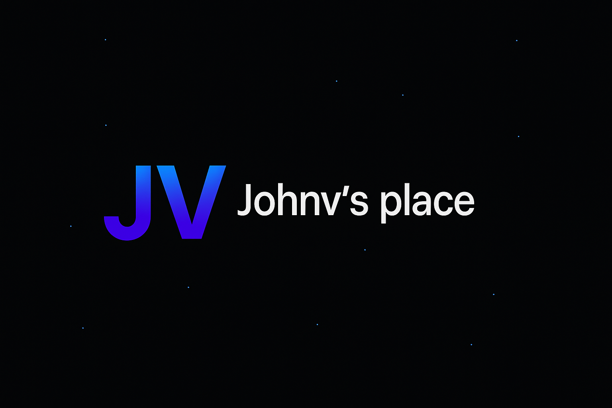

 

  <kbd>
    
  </kbd>

 

# johnv.place

✨ My personal portfolio — built with **Next.js 14**, **Tailwind CSS v4**, **shadcn/ui**, and **framer-motion**.

---

## 🚀 Status
> **Important:**  
> The initial scaffold of this project was created with [V0](https://v0.dev), and I am **gradually evolving and refactoring it manually**.  
> I decided to publish it anyway to document my journey and show progress transparently.

---

## 📂 Stack
- [Next.js 14](https://nextjs.org)
- [Tailwind CSS v4](https://tailwindcss.com)
- [shadcn/ui](https://ui.shadcn.com)
- [framer-motion](https://www.framer.com/motion)
- Deploy: [Vercel](https://vercel.com) or GitHub Pages

---

## ✅ What I have changed so far
- Initial layout and navigation structure
- Color scheme and typography customization
- Animation tweaks
- Page structure (`/resume`, `/projects`, etc.)

---

## 🎯 Next steps (roadmap)
- [X] Remove unused dependencies
- [X] Rewrite sections with custom code (no scaffold)
- [ ] Improve accessibility (labels, focus, contrast)
- [ ] Add basic tests with Vitest/RTL
- [ ] Enhance SEO (title/description per page, OG tags, sitemap)
- [ ] Create an English version
- [ ] Add resume generation in PDF - in progress

---

## 🌐 Deploy
🔗 [johnv.place](https://johnv.place)

---

## 📜 License
This project is licensed under the **GNU General Public License v3.0 (GPLv3)** — see the [LICENSE](./LICENSE) file for details.  

It also follows a [Code of Conduct](./CODE_OF_CONDUCT.md) to ensure a welcoming and respectful community.

---
